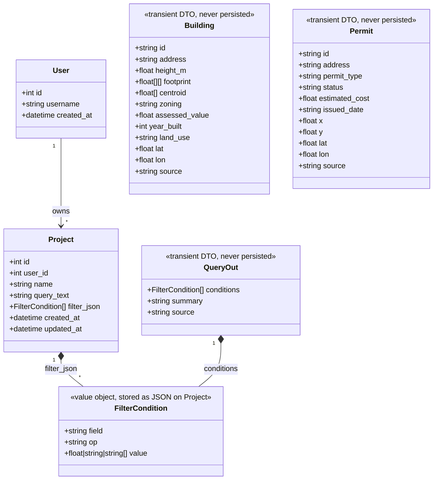
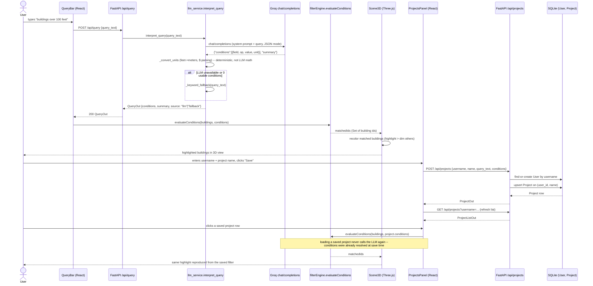

# UML — data models and query flow

Two diagrams: a class diagram covering what's actually persisted (and what
deliberately isn't), and a sequence diagram for the natural-language query
→ highlight → save/load flow.

## Class diagram

Only `User` and `Project` are persisted (SQLite, via `backend/app/models.py`).
`Building`, `Permit`, and `QueryOut` are **transient** — fetched fresh from
Calgary Open Data (or mock) on every request and never written to the
database; they're shown here as plain DTOs so the shapes flowing through
the system are documented in one place, not because they live in a table.

## Sequence diagram

Covers the full loop: typing a query, the LLM turning it into a filter,
the frontend highlighting matches, then optionally saving that filter as a
named project and reloading it later (which skips the LLM entirely).

